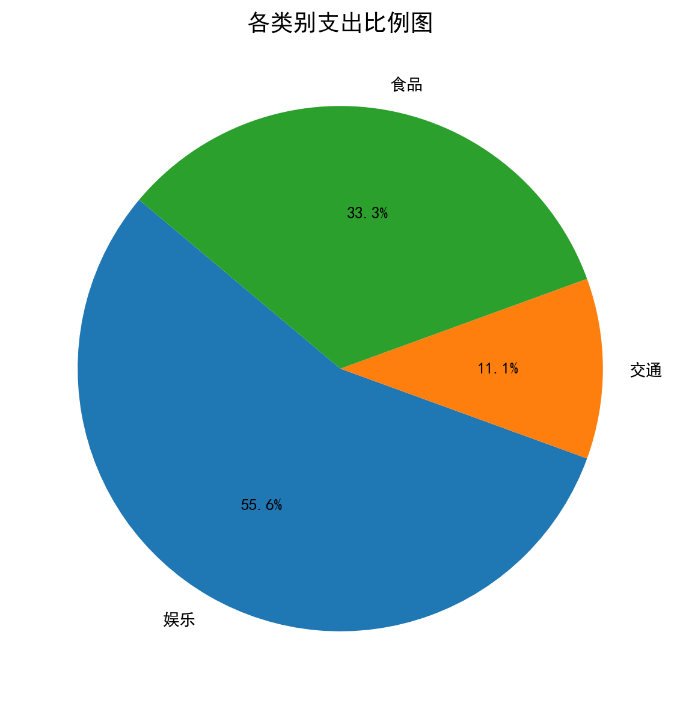
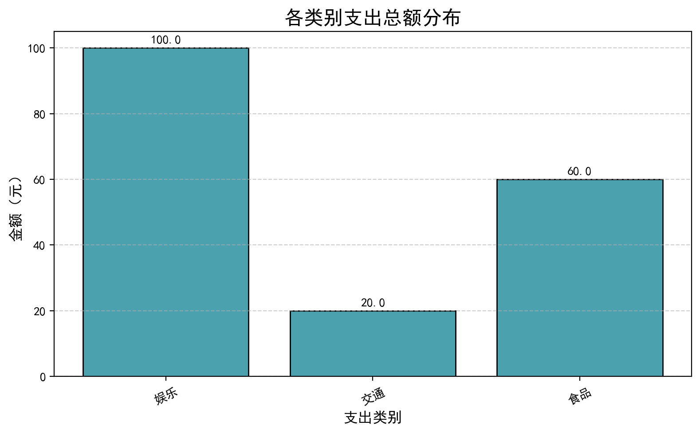

# 💰 SmartBudget CLI — 命令行记账与可视化工具

一个基于 Python 开发的轻量级命令行记账系统，支持账单记录、汇总统计与可视化分析。  
通过 `Rich` 实现彩色终端输出，结合 `Matplotlib` 自动生成支出饼图与柱状图。  
项目适合用于学习 **文件操作、数据分析、命令行交互与数据可视化**。

---

## 🚀 功能展示

### 📥 添加账单
```bash
python budget.py add 35 食品 早餐
python budget.py add 100 娱乐 电影票
📋 查看所有账单
python budget.py list

📊 查看支出汇总
python budget.py summary

🖼️ 生成图表
python budget.py chart


输出文件：

expense_pie_chart.png — 支出比例饼图

expense_bar_chart.png — 各类别支出柱状图

🧩 项目结构
SmartBudget-CLI/
├── budget.py                # 主程序
├── expenses.csv             # 账单数据（示例）
├── expense_pie_chart.png    # 饼图示例（截图）
├── expense_bar_chart.png    # 柱状图示例（截图）
├── README.md                # 项目说明（当前文件）
└── requirements.txt         # 依赖库列表

⚙️ 技术栈

语言：Python 3

库：Rich、Matplotlib

特性：

命令行参数解析（argparse）

文件持久化存储（CSV）

支出自动汇总与分类统计

可视化输出（饼图 / 柱状图）

中文界面支持（无乱码）

💡 项目亮点

完整的命令行交互逻辑

美观的 Rich 终端表格

自动生成图表（适合作品集展示）

支持中文类别与备注

可轻松扩展：预算提醒 / 月度趋势分析

📘 运行环境

1️⃣ 安装依赖

pip install -r requirements.txt


2️⃣ 运行程序

python budget.py --help


支持命令：

add, list, summary, delete, chart

📈 截图展示





饼图	柱状图

	
✨ 作者与声明

作者：刘萦之（计算机科学与技术专业）
项目时间：2025年11月
项目链接：https://github.com/Jade-Liu1006/SmartBudget-CLI

该项目为个人学习与展示用途，可自由复用与扩展。